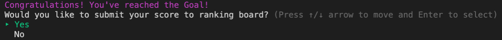

# Sugoroku - CLI Application


## GitHub repository
https://github.com/clareahnem/Sugoroku-terminal-app
## How to Use this Application

To start this application on your computer, please download the zip file from this GitHub repository. All of the files required for the application to run will be stored in src/ directory, hence from your root directory move into the src directory by typing `cd src`. Once you are in the correct directory, type `./Terminal_Sugoroku.sh` on your command line to start the application. 

Since this application was built using Ruby language, you must make sure that you have ruby installed on your computer. You can do so by typing in `ruby -v` on your terminal, or from the `src` directory containing this app type `ruby index.rb -i` to see what version of ruby you are running on. This app was build on ruby version 2.7.1 hence you may run into some issues if you are using a much older version of ruby. 

This application also depend on several ruby gems. If you are a mac user and have ruby installed, you will be able to download ruby gems automatically. However, for any other computer systems make sure that you have RubyGems downloaded, so that you can install the following dependencies. Instructions on how to download RubyGems are listed on the Rubygems website: https://rubygems.org/pages/download

**Users must make sure that they have the following ruby gems installed before running the application;**
 - colorize version 0.8.1
 - tty-prompt version 0.23.1
 - tty-spinner version 0.9.3
 - tty-table version 0.12.0
 
 If you do not have any one of these gems with the correct versions, please install them using bundler. If you have not used bundler before, make sure you install it first by running the command `install bundler` onto your local machine. You can then install all of the gem dependencies by running `bundle install` command. 


## Software Development Plan
### Purpose and scope of this Application
This is a terminal application for a simple, single player Sugorouku Game created using Ruby programming language. Sugoroku is a Japanese name for a type of board games where players move around a board by rollong the dice. The board panels that players land on will often have tasks or activities that adds entertainment to the game. In most Sugoroku, the goal of the game is to reach the finish line with fewer number of turns or with the highest score.  

I have created the Sugoroku Application with a purpose to learn more about Ruby programming, and to build an applciation that was interactive, fun and visually entertaining.

For this CLI Sugoroku Application, I created Sugoroku Game where each panel will give players certain number of points. The aim of this game will be to reach the finish line with the highest score possible. Scores are compared by a ranking system that will show top 100 scores submitted to your local game file.

The target audience of this application are the educators and students of my academy. It is also for anyone who are interested in CLI game applications or learning about CLI applications that have some time to spare for a fun little game. Users must be comfortable nagivating through files on their Terminal in order to install necessary programs or files to start playing this game. 

For details on how to download and start using this application, on please refer to the **How to use this application** section of this document. 

### Features and User Interactions
The CLI Sugoroku app consists of the 3 main features which are all accessible from the main menu page; 


Main menu page is created using TTY-Prompt ruby gem and uses case statement to navigate users to different features. the entire main menu section is contained inside a while loop, and can only be exited when terminal reads the `exit` keyword (written in my `exit_program` method). This means that whenever users go through different features of the app and they do not choose to exit the page in the end, program will start running from the top of the while loop again, which will display the main menu.


#### Feature 1: How to Play


This is a feature that will contain information about what a Sugoroku Game is, and how this game will be played.  Below the ascii text title which is hard-coded, game rules are outlined step by step so that users can undertand the purpose of the game, and what they should be aiming to achieve by the end.  

Below the text outputted from instructions.txt, users will see a question that allows them to choose whether to navigate back to main menu page or exit the program entirely. If user chooses to exit the page, it will ask users to confirm their exit using another prompt "Are you sure?" in which they can respond by yes (y) or no (n)

***How this is coded***
- the ASCII text title is hard-coded and is stored in src/methods/ascii.rb. the art itself was rendered using an ascii text generator website. (patorjk.com)
- Text containing information about Sugoroku and its rules are stored in a text file (src/files/instructions.txt) and is printed out line-by-line to the CLI using `File.foreach` method. In order to prepare for potential error in locating the txt file, I have implemented error handling to `rescue` the program from crashing. 
- Prompt asking user to go back to menu or exit page was created using TTY-prompt hence error is already being handled by the gem. The confirmation question "Are you sure?" to which they should respond with `y`/`Y` to exit the program is also created using TTY-prompt gem.


#### feature 2: Play Sugoroku Game


This is the main feature of this application, and is where users can play the Sugoroku Game. Once this feature is selected from the main menu, CLI will display an ascii text to indicate the game is starting, and then asked to submit their name they want to use for the game. The game will start when user submits their name.

Once the game is started, CLI will render the Sugoroku Game board along with a table containing the user's name they have submitted, the number of steps they have taken (with step 33 being the goal) and their current score . On the sugoroku Board, the position of the user is indicated by the emoji icon. 


From here, user will be asked to roll the dice by pressing the enter key. The number they have rolled will be the number of steps they can take. Users can either land on;
- **standard (shown white on image) panel**: adds 100 points to score
- **green panel**: adds 300 points to the score
- **red panel**: subtracts 100 points from the score. Users can get negative scores for this game. 
- **blue panel**: leads to bonus round where users roll the dice once again. The number that they rolled in this round is the number that users get to multiply their score by. If users have a negative score, their score will multiply to a nagative number. 


The user's position on the board, total steps taken and current score will change accordingly and will be displayed on the screen each time users roll the dice. The process will be repeated until the user reaches the goal.

Once the user reaches the goal, they will get the options to;

- **submit their score to the ranking board**: users can choose yes or no. If they select yes, their name and final score will be saved to the game file. If they select no, this process will be skipped.

- **play again or go back to menu**: If the user chooses to play again, the score and position will reset and game will start from the starting position. In this case, the name will not be asked again and the game loads with the same name they have initially submitted. If the player chooses to go back to the menu, CLI will navigate back to the main menu. 


***How this is coded***
- the name is collected using `gets.chomp` method. This is stored in a variable and is used to initialise `class Play` with user's name, position and score as its instance variable. Once this is done, rest of the game is coded inside a while loop so that user can play the game over and over again without going back to the main menu, or changing their name. (`@position` and `@score` resets each iteration, but `@name` does not)
- To prevent users from continuing to the game without submitting a name, I have raised an ArgumentError for when submission is empty. This is then rescued with a message in order to prevent the entire program from crashing.
 ```
 begin
        puts "Choose your name:"
        username = gets.chomp
        raise ArgumentError if username.empty? 
    rescue
        puts "Name cannot be empty. Please try again"
        retry
    end
```
- Sugoroku Game board is rendered using a new class called `SugorokuBoard` which stores strings and arrays that will become the borders and panels of the board. The positioning of the user icon is implemented by passing the `@position` value from `class Play` to a method inside `class SugorokuBoard`, which edits the array for board panels initialised in the class before printing it to the CLI.
- The table which contains `@name` `@position` and `@score` of user is rendered using TTY-table gem, which takes in arrays as rows of table data
- Effect given for rolling the dice was created using a cobination of TTY-prompt and TTY-Spinner. TTY_prompt allows dice rolling to be initiated and stopped by prompting user to press the enter key. When dice rolling is initiated TTY-Spinner allows numbers 1 to 6 to flash consecutively by using each integer as a frame. when dice roll is ended by pressing enter key, CLI will display a random number between 1 and 6. 
```
def roll_dice
    prompt = TTY::Prompt.new
    prompt.keypress("Press enter to roll the dice and enter again to stop", keys: [:return])
    # start spinner when enter keyt is pressed
    spinner = TTY::Spinner.new(frames: ["1", "2", "3", "4", "5", "6"], clear: true)
    spinner.auto_spin
    # stop spinner by pressing enter
    prompt = TTY::Prompt.new
    prompt.keypress(keys: [:return])
    spinner.stop
    rand(1..6)    
end
```
- score is added to `@score` according to the color of the board panel users land on, using case statements for user's `@position`. Utilising this, CLI will display different messages depending on which colored panel they have landed on. I have further implemented an if/else statement within this case statement for when user lands on the blue panel. Since landing on the blue panel can increase, decrease or make no change to user's score, implementing an if/else statement will allow different message string to be displayed onto the CLI.
- user will repeat the progress through the board until goal using `unless @position > 32` iterator. Since the goal is at position 33, iterator will break once the goal has been reached. 


#### Feature 3: Ranking Board.


This feature allows the user to view the top 100 scores that have been submitted to the downloaded CLI Application files in a table format. Each column will contain the name of the user, their current rank and their score. Each time the user completes the game in "Play Sugoroku" feature, they will be asked whether they want to submit their score to the ranking board. If they choose to do so, the score will be stored in the game file. If their score is in the top 100, their name and score will be displayed in the ranking board at their appropriate rank. This encourages the users to play the game multiple times to beat their previous scores, or even invite their friends to compete on who will have the higher score.

At the bottom of the CLI, users will be given a choice to either go back to the main menu or exit the program completely. 

***How this is Coded***

- When a user chooses to submit their score to the ranking board, a class method `save_data` (inside `class Play`) will be activated. Here, user's `@name` and `@score` will be appended to the src/files/ranking.txt file in a new line. Error handling was added here in case file cannot be located or accessed, with success or failure messages appearing depending on whether an error has occurred. TTY-spinner was utilised here to add a loading effect before displaying success/error message. 
```
begin
    File.write('files/ranking.txt', "#{name}, #{score}\n", File.size('files/ranking.txt'), mode: 'a')
rescue
    loading_spinner(2, "Error loading file. Your score could not be added.")
else
    loading_spinner(2, "Your score has been successfully submitted.")
end

```
- When user selects "View Ranking Board" on the main menu, the program must take information stored in ranking.txt, sort them in order of highest score to lowest score and render it as a table. 
- To do so, program will first access the ranking.txt file, which contains user's name and their score on each line. It converts this information into a hash by splitting the information line by line, and then assigning each name as the key and their score as the paired value. Error handling was implemented to rescue from crashing in case the program fails to locate file.
- By putting data into a hash, I am able to then sort the key-value pairs by their value i.e. their score. Since `.sort-by` method sorts items from lowest to highest number, I utilised `.reverse` method to sort them in the opposite order. Applying `.sort_by` method to a hash converts data into an array, where each index value is a child array containing key and the value.
- Since we only need to display top 100 scores, if user data exceeds 100, we must delete them from the ranking array. This is done so using `.slice(0, 100)` method on the array to filter out excessive data.
- In order to assign rank position to each user, I have used `.each` iterator to push rank numbers into the array.
- This array is then rendered onto the table using TTY-Table gem, and displayed onto the CLI.
 


### Flow Chart


### Implementation Plan
***Trello***

Planning the Creation process of this application was mostly completed using Trello.
Here is the link: https://trello.com/b/ju8bPY0B/terminal-app-sugoroku

I have added appropriate labels for each task to indicate whether it is a Donut task (Core of Application. Must be completed for Application to be a Minimum Viable Product) or a Sprinkle task (Decorative. Can be added but Application can also run wuthout it). More labels were created to indicate the difficulty of task so that I can effectively manage time. 

***Manual Testing using Excel***

During the coding process I have also used an excel sheet to manually test my code. 
Here is the link: https://docs.google.com/spreadsheets/d/1Wi38tJLZNAkXqrJqyeeonaHfczbvBRVzld4yyUN3Eac/edit?usp=sharing 

I have assigned task IDs to different features or sections of code that I was testing and wrote down in detail what I was aiming to achieve in my code. 
I have decided to do manual testing so I could keep record of my failed attempts, unlike rspec automated testing. It was easier to visualise the thought process of why I want to do certain tasks in certain ways. As an individual who is just learning about TDD using rspec, manual testing was also less time consuming, hence allowed for more time to focus on making the actual program code work efficiently. However, the downside of manual testing is that I cannot set up a test variable unless I hard code them onto my file. Since this would "mess up" my code in some cases, I had to create a separate testing environment (test.rb) with all gems made available to test out some of my code. 


