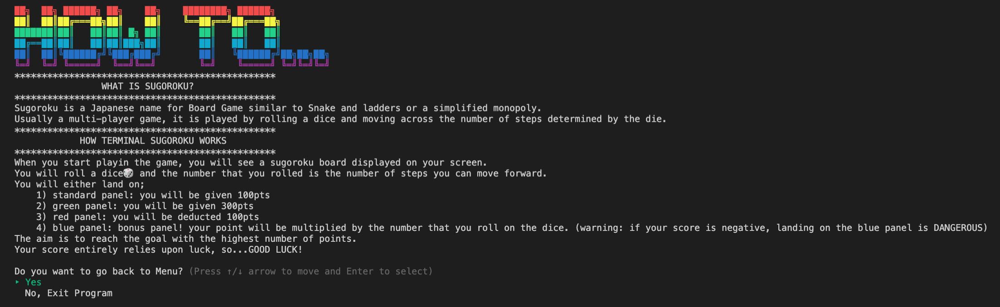
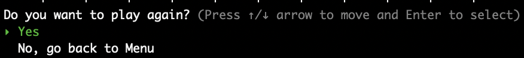

# Sugoroku - CLI Application

## GitHub repository
https://github.com/clareahnem/Sugoroku-terminal-app
## How to Use this Application

To start this application on your computer, please download the zip file from this GitHub repository. All of the files required for the application to run will be stored in src/ directory, hence from your root directory move into the src directory by typing `cd src`. Once you are in the correct directory, type `./Terminal_Sugoroku.sh` on your command line to start the application. 

 - steps to install app
 - dependencies required
 - system/hardware requirements
## Software Development Plan
### Purpose and scope of this Application
This is a terminal application for a simple, single player Sugorouku Game created using Ruby programming language. Sugoroku is a Japanese name for a type of board games where players move around a board by rollong the dice. The board panels that players land on will often have tasks or activities that adds entertainment to the game. In most Sugoroku, the goal of the game is to reach the finish line with fewer number of turns or with the highest score.  

I have created the Sugoroku with a purpose to learn more about Ruby programming, and to build an applciation that was interactive, fun and visually entertaining.

For this CLI Sugoroku Application, I created Sugoroku Game where each panel will give players certain number of points. The aim of this game will be to reach the finish line with the highest score possible. Scores are compared by a ranking system that will show top 100 scores submitted to your local game file.

The target audience of this application are the educators and students of my academy. It is also for anyone who are interested in CLI game applications or learning about CLI applications that have some time to spare for a fun little game. Users must be comfortable nagivating through files on their Terminal in order to install necessary programs or files to start playing this game. 

For details on how to download and start using this application, on please refer to the **How to use this application** section of this document. 

### Features
The CLI Sugoroku app consista of the following 3 main features which are all accessible from the main menu page; 

#### 1. How to Play

This is a feature that will contain information about what a Sugoroku Game is, and how this game will be played.  Game rules are outlined step by step so that users can undertand the purpose of the game, and what they should be aiming to achieve by the end. 
At the bottom of the CLI, users will see a question that allows them to choose whether to navigate back to main menu page or exit the program entirely. 

#### 2. Play Sugoroku Game

This is the main feature of this application, and is where users can play the Sugoroku Game. Once this featire is selected from the main menu, users are asked to submit their name they want to use for the game. Once this is submitted, the game will start. 

When the game is started, CLI will display the Sugoroku Game board along with a table containing the user's name they have submitted, the number of steps they have taken (with step 33 being the goal) and their current score. On the sugoroku Board, the position of the user is indicated by the emoji icon.

From here, user will be asked to roll the dice by pressing the enter key. The number they have rolled will be the number of steps they can take. Users can either land on;
- **standard (shown white on image) panel**: adds 100 points to score
- **green panel**: adds 300 points to the score
- **red panel**: subtracts -100 points to the score. Users can get negative scores for this game. 
- **blue panel**: leads to bonus round where users roll the dice once again. The number that they rolled in this round is the number that users get to multiply their score by. If users have a negative score, their score will multiply to a nagative number. 

The position on the board, total steps takemn and current score will change accordingly and will be displayed on the screen each time users roll the dice. The process will be repeated until the user reaches the goal.

Once the user reaches the goal, they will get the options to;

- **submit their score to the ranking board**: users can choose yes or no. If they select yes, their name and final score will be saved to the game file. If they select no, this process will be skipped.

- **play again or go back to menu**: If the user chooses to play again, the score and position will reset and game will start from the starting position. In this case, the name will not be asked again and the game loads with the same name they have initially submitted. If the player chooses to go back to the menu, CLI will navigate back to the main menu. 

#### 3. Ranking Board.

This feature allows the user to view the top 100 scores that have been submitted to the downloaded CLI Application files in a table format. Each column will contain the name of the user, their current rank and their score. Each time the user completes trhe game in "Play Sugoroku" feature, they will be asked whether they want to submit their score to the ranking board. If they choose to do so, the score will be stored in the game file. If their score is in the top 100, their name and score will be displayed in the ranking board at their appropriate rank. This encourages the users to play the game multiple times to beat their previous scores, or even invite their friends to compete who will have the higher score.

At the bottom of the CLI, users will be given a choice to either go back to the main menu or exit the program completely. 

### UI/UX of this Application
### Flow Chart
### Implementation Plan

